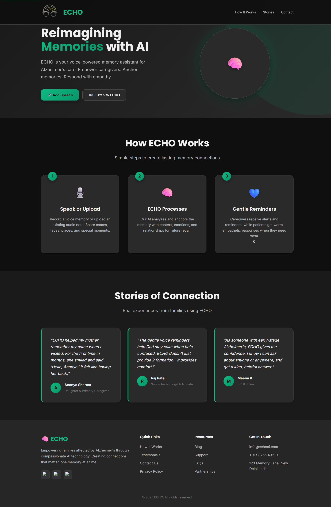

# ECHO: AI-Powered Memory Assistant for Alzheimer's Patients 🧠

## Overview
ECHO is an innovative, privacy-first memory assistant powered by artificial intelligence and built on the Internet Computer Protocol (ICP). Designed specifically for Alzheimer's patients, it provides:

- 🎯 Context-aware memory cues
- 👨‍👩‍👧‍👦 Real-time caregiver support and alerts
- 🔒 Privacy-focused memory anchoring
- 🤖 AI-driven emotional intelligence
- 📱 User-friendly interface

## Website OverviewECHO: AI-Powered Memory Assistant for Alzheimer’s Patients</b>

## Overview
ECHO is a modular, privacy-first memory assistant built on the Internet Computer Protocol (ICP). It helps Alzheimer’s patients with context-aware cues and supports caregivers with real-time alerts and memory anchoring.

## Website Overview


## Backend Overview

# Text emotion detection


# Voice to text emotion detection


# Emotion Detection Stats


## ✅ Features

| Feature                          | Description |
|----------------------------------|-------------|
| 🧠 Smart Memory Queries           | Answers patient questions using pre-set or AI-generated responses |
| 🔐 On-chain Actor Logic (Motoko) | Secure, tamper-proof memory logic stored on ICP |
| 👩‍⚕ Caregiver Anchoring          | Caregivers can set names, identities, or routine facts for recall |
| 🧪 Emotion Detection (Optional)   | Detects vocal stress using Whisper or pyAudioAnalysis |
| 🧩 Dspy-AI Reasoning (Optional)   | LLM agent generates calming, empathetic, dynamic replies |
| 📲 Real-time Caregiver Alerts     | Notifies family in critical behavior (e.g., wandering or distress) |
| 🌐 agent-js Frontend              | Lightweight HTML/JS interface that talks to ICP canister |
| 🔗 Inter-Canister Communication   | Future support for caregiver ↔ patient sync architecture |
| 📊 Logging & Analytics            | Optional logging of queries for pattern review and analytics |
| 🛠 Modular Design                 | Easy to extend with face recognition, TTS, IoT, and more |

---

## 🧱 Architecture Overview

```plaintext
[Patient Device / Web Interface]
        ↓
  [agent-js → ICP Canister]
        ↓
[MemoryAssistant.mo (Motoko)]
        ↓     ↑
 [ML API (FastAPI + Whisper)]
        ↓
[Empathetic Reply / Alert / Log]
```
## Project Structure
### Tech Stack

| Layer             | Technology                               | Role / Purpose                                                                 |
|------------------|-------------------------------------------|--------------------------------------------------------------------------------|
|  Frontend       | HTML, CSS, JavaScript (agent-js)          | Patient-facing UI and communication with the ICP canister                     |
|  Smart Contracts | Motoko (on Internet Computer)             | On-chain logic for memory queries, caregiver updates, and patient data        |
|  SDK / Bridge    | agent-js (DFINITY JavaScript SDK)         | Enables frontend to securely communicate with the ICP backend (canister)      |
|  Dev Tools       | DFX CLI, ICP Local Replica                | Tooling to develop, test, deploy Motoko canisters on local/test/main network  |
|  ML/AI Layer     | Python, FastAPI, Whisper, pyAudioAnalysis | Emotion detection from voice or text inputs; optional behavior inference       |
|  LLM Agent       | Dspy.ai                                   | Generates adaptive, empathetic responses using language models (LLM agent)     |
|  Hosting         | Replit, Render, or ICP Mainnet            | Hosts frontend, ML API, and canisters for demo or production environments      |

## 🚀 Quick Start Guide

### Prerequisites
- ✅ DFX SDK v0.15.0 or higher (for Motoko/ICP development)
- ✅ Node.js v16+ (for frontend development)
- ✅ Python 3.8+ (for ML backend features)

### Installation & Setup

1. **Clone & Navigate**
   ```sh
   git clone https://github.com/yourusername/echo_memory_assistant.git
   cd echo_memory_assistant
   ```

2. **Start ICP Local Development Environment**
   ```sh
   dfx start --background --clean
   ```

3. **Deploy Smart Contracts**
   ```sh
   ./deploy.sh
   ```

4. **Launch Frontend**
   - Navigate to `frontend/index.html` in your browser
   - For development: Use a local server like `python -m http.server 8000`

5. **Setup ML Backend (Optional)**
   ```sh
   cd backend-ml
   python -m venv venv
   # For Windows
   .\venv\Scripts\activate
   # For Unix/MacOS
   source venv/bin/activate
   pip install -r requirements.txt
   uvicorn app:app --reload --port 8080
   ```

## 🔌 Frontend Integration Guide

### Connecting to the ICP Canister
1. **Generate JavaScript Bindings**
   ```sh
   dfx generate memory_assistant
   ```

2. **Setup Frontend Dependencies**
   ```sh
   # Copy generated bindings
   cp .dfx/local/canisters/memory_assistant/memory_assistant.js frontend/
   
   # Install dependencies (if using npm)
   cd frontend
   npm install @dfinity/agent
   ```

3. **Update HTML Integration**
   ```html
   <!-- Add these scripts in order -->
   <script src="node_modules/@dfinity/agent/lib/index.js"></script>
   <script src="memory_assistant.js"></script>
   <script src="main.js"></script>
   ```

## 🎯 Using ECHO

### For Patients
- Simply speak or type natural questions like:
  - "Who is this person?"
  - "Where am I right now?"
  - "What time is my medication?"
- The AI will provide context-aware, empathetic responses

### For Caregivers
- Set up personalized memory anchors
- Receive real-time emotional state alerts
- Track interaction patterns and behavior changes
- Configure custom reminders and routines

## 🛠️ Extending ECHO

### Add New Features
- Implement additional Motoko canisters for enhanced functionality
- Integrate custom ML models for specialized detection
- Add voice synthesis (TTS) for more natural interaction
- Implement IoT device integration for smart home support

### Contribute
1. Fork the repository
2. Create your feature branch
3. Commit your changes
4. Push to the branch
5. Create a Pull Request

---

📚 For detailed documentation, check the code comments in each module. 
